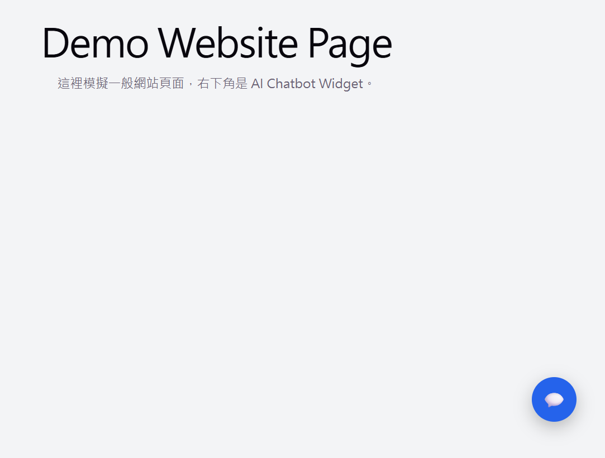
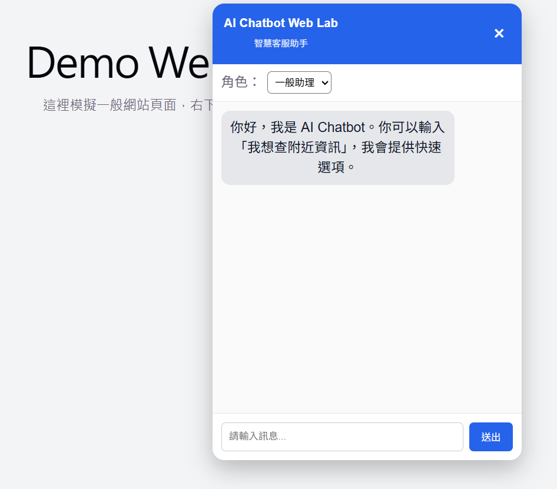
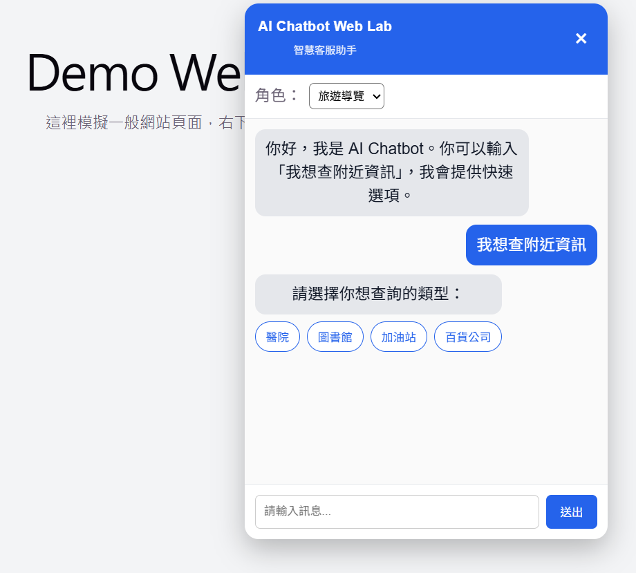
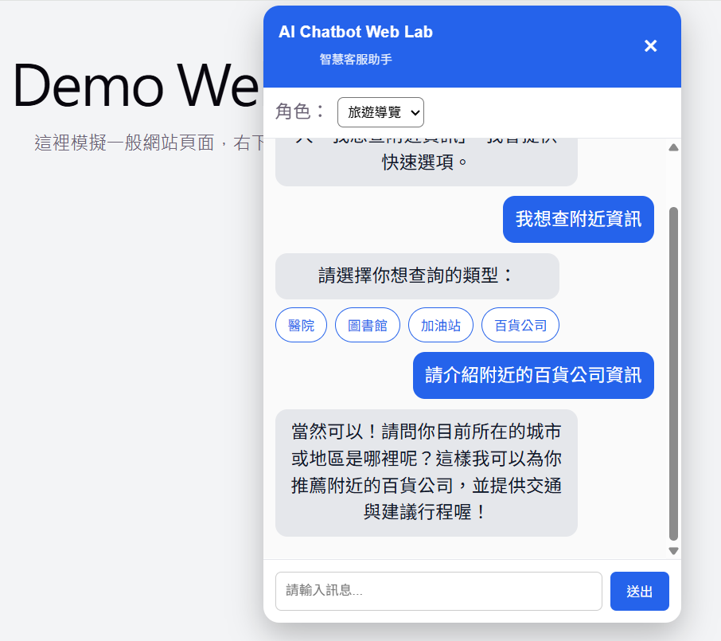
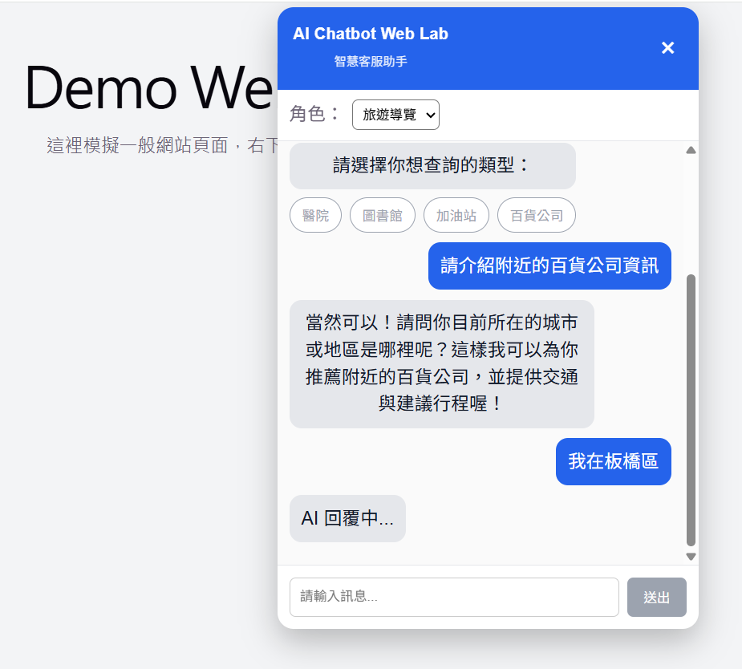
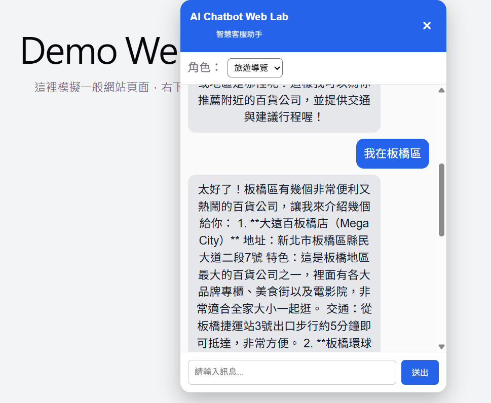

# 🤖 AI Chatbot Web Platform

一個可嵌入網站的 AI 客服聊天機器人系統，支援多輪對話、RAG（知識庫問答）、Streaming 回應，以及完整 Observability（Prometheus + Grafana 監控）。


---

## 🎯 專案定位

本專案目標為打造一個：

✔ 可實際部署  
✔ 可嵌入任意網站（Floating Widget）  
✔ 可用於面試 Demo  
✔ 可展示 Backend / DevOps / AI 能力  

的 AI Chatbot 系統。

---

## 🧩 系統特色

### 💬 AI 對話能力
- OpenAI API 整合
- 多輪對話（Conversation History）
- System Prompt（aiRole）角色切換

### 🧠 RAG（Retrieval-Augmented Generation）
- Keyword-based FAQ 匹配
- Embedding-based 語意搜尋（Cosine Similarity）
- FAQ Context 注入 Prompt
- AI 自然回應（非死回）

### ⚡ 使用者體驗
- Quick Reply / Inline Quick Reply
- Streaming 回應（逐字輸出）
- Vue Floating Chat Widget（可拖曳 / 收合）

### 🗂 資料管理
- MySQL 對話紀錄（chat_logs）
- user / assistant 分角色存儲

### 📊 Observability（監控🔥）
- Spring Boot Actuator + Micrometer
- Prometheus metrics 收集
- Grafana Dashboard 可視化
- 自訂 AI Latency 指標（重點）

---

## 🏗 技術架構


| 層級           | 技術                          |
|----------------|-------------------------------|
| Frontend       | Vue 3                         |
| Backend        | Spring Boot                   |
| Database       | MySQL                         |
| AI             | OpenAI API                    |
| RAG            | Embedding + Cosine Similarity |
| Streaming      | SSE (SseEmitter)              |
| Observability  | Prometheus + Grafana          |
| DevOps         | Docker / Docker Compose       |

---
## 🧠 系統架構

```
User (Browser)
 ↓
Vue Floating Chat Widget
 ↓
Spring Boot API (/api/chat)
 ↓
RAG（FAQ + Embedding）
 ↓
OpenAI API
 ↓
Response（Streaming）
 ↓
MySQL（chat_logs）
 ↓
Prometheus（metrics）
 ↓
Grafana（Dashboard）
```
---

## 📊 監控（Observability）

### 🔹 API Metrics

- QPS（Requests/sec）
- HTTP Status 分佈
- Top API Endpoints
- Error Rate

### 🔹 AI Metrics（自訂🔥）

- AI 回應延遲（Latency）
- RAG vs Normal 效能差異

### 🔹 技術實作

```
Micrometer Timer → Prometheus → Grafana
```

---

## 🖥 系統畫面（Demo）

👉 Floating Chat Widget（右下角 AI 客服）


👉 Quick Reply 按鈕操作



👉 多輪對話 + AI 回應









---
## 📈 Grafana Dashboard（監控畫面🔥）

👉 API QPS / Error Rate / Status 分佈

👉 AI Latency（自訂指標）

---

## ⚡ 快速啟動

# 設定 API Key（PowerShell）

$env:OPENAI_API_KEY="your_api_key"

# 啟動

docker compose down
docker compose up -d --build

---

## 🔗 API 測試

$body = @{  
  message = "你好"  
  messages = @(  
    @{  
      role = "user"  
      content = "你好"  
    }  
  )  
  aiRole = "default"  
} | ConvertTo-Json -Depth 5  

Invoke-RestMethod `  
  -Uri "http://127.0.0.1:8080/api/chat" `  
  -Method Post `  
  -ContentType "application/json; charset=utf-8" `  
  -Body $body

---

## 🧪 資料庫查看

docker exec -it chatbot-mysql mysql --default-character-set=utf8mb4 -uappuser -papppass chatbot  

SELECT * FROM chat_logs ORDER BY id DESC LIMIT 3\G

---

## 📌 專案目標

本專案用於展示以下能力：

✔ AI 系統設計

- RAG（FAQ + Embedding）
- Prompt Engineering（aiRole）

### ✔ 高互動 UI

- Streaming 回應（SSE）
- Quick Reply UX

### ✔ DevOps 能力

- Docker Compose 一鍵啟動
- 本地完整環境模擬

### ✔ Observability（關鍵🔥）

- Prometheus + Grafana
- 自訂 AI Latency metrics
- API + AI 雙層監控

---

## 🧭 未來擴展（Roadmap）

- Widget SDK（嵌入其他網站）
- JWT 使用者系統
- AI Token usage 監控
- 多模型切換（OpenAI / Local LLM）
- Kubernetes 部署

---

## 👨‍💻 作者

Jeremy Hsu  
Backend / DevOps / Platform Engineer
